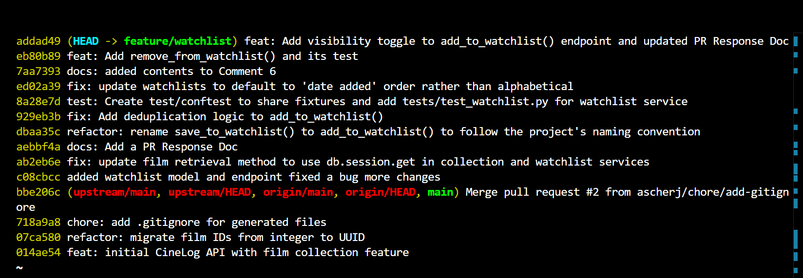

# PR Response Doc — CineLog Watchlist Feature

## AI Usage
I used Copilot in VSCode to orient myself in the codebase, especially to understand how the watchlist service, routes, and SQLAlchemy models fit together. I also used it to sanity-check my review responses and commit-message wording, including whether the watchlist sort-order change was better described as a fix or a feature.

For Comment 4, I asked what a careful reviewer might object to about a public-by-default watchlist. The AI helped surface the privacy-vs-discovery tradeoff, but I adjusted the final response to make the privacy concern more explicit and to acknowledge that private-by-default with opt-in sharing is the more privacy-conscious design.

For Comment 5, I asked whether the sort-order change should be described as a fix, feature, perf, chore, or style change. The AI's guidance supported `fix:` as the best fit, and I kept that reasoning because the change corrects the default behavior rather than adding a new user-facing capability.

## Comment 1 — Rename
**What I did:**

I renamed `save_to_watchlist()` to `add_to_watchlist()` in [services/watchlist_service.py](services/watchlist_service.py) so the function name matches the rest of the codebase's verb-to-noun convention. After that, I used VS Code's "Find All References" to locate and update every call site and import that referenced the old name so the service and routes stayed consistent.

**How I verified:**

I ran the watchlist test file after the rename and confirmed the feature still passed end-to-end.

## Comment 2 — Deduplication
**What I did:**

I added duplicate-check logic to `add_to_watchlist()` in [services/watchlist_service.py](services/watchlist_service.py) following the example of add_to_collection() in [services/collection_service.py](services/collection_service.py). Before creating a new `WatchlistEntry`, the service now checks whether the same `user_id` and `film_id` already exist and raises `AlreadyInWatchlistError` instead of inserting a second row.

**How I verified:**

I added a duplicate-add test in [tests/test_watchlist.py](tests/test_watchlist.py) that adds the same film twice, confirms `AlreadyInWatchlistError` is raised, and checks that only one database row exists.

## Comment 3 — Missing test
**What I did:**
I moved the shared test fixtures into [tests/conftest.py](tests/conftest.py) so both collection and watchlist tests can reuse the same `app`, `sample_user`, and `sample_film` setup through pytest's built-in fixture discovery. I then added [tests/test_watchlist.py](tests/test_watchlist.py), modeled after `test_add_to_collection_nonexistent_film_raises`, to cover the basic watchlist add flow and make sure the new service behavior is exercised by an automated test. The new `test_add_to_watchlist_nonexistent_film_raises` specifically checks that a missing `film_id` raises `FilmNotFoundError`.

**How I verified:**

I ran the test suite and confirmed the shared fixtures and watchlist test file load correctly.

## Comment 4 — Default visibility

**My position:**

I kept watchlists defaulting to `public=True`.

**Reasoning:**

That default makes the feature useful immediately for discovery and sharing, which fits the watchlist's social purpose. A public default also avoids hiding user-curated lists behind extra configuration when the goal is to let people see what others plan to watch.

**Tradeoff acknowledged:**

I understand the privacy concern in the review comment. The tradeoff is that a public default improves visibility and sharing, but it does so at the cost of user privacy and explicit consent. A user may reasonably expect a watchlist to stay private unless they choose to share it, so the more privacy-conscious design would be private-by-default with an explicit opt-in to public visibility. I kept the current default for product simplicity and social discovery, but I agree that a future privacy toggle would be the right follow-up.

## Comment 5 — Sort order
**My position:**

I agree that watchlists should default to "date added" order instead of alphabetical order.

**Reasoning:**

The watchlist can be used as a personal planning tool, so the most useful default is to surface the films a user saved most recently. Alphabetical order is stable, but it hides recency and makes the list feel less like a queue.

**Engagement with reviewer's point:**

I updated the changes in watchlist_service.py to match the intent of the feature: a watchlist should help users revisit what they recently added, not force them to scan titles in a list that has no relationship to when they saved them.

## Comment 6 — Rebase
**What conflicted:**

.gitignore, my version has .pytest_cache/ but the other version doesn't

**How I resolved it:**

Kept my version because it already included the other commit's .gitignore entries and only added the missing .pytest_cache/ rule, so no ignore behavior was lost.

**How I verified no conflict remains:**

I reran git rebase --continue and it didn't raise conflict.

## Additional Test

I added a watchlist test for adding a nonexistent film because it checks the service's validation path, not just the happy path and duplicate handling. This gives the watchlist feature coverage for the same missing-film rule that the collection service already enforces, so both services stay consistent.

## Visibility Toggle

I updated the watchlist add endpoint so callers can pass `public` explicitly instead of relying only on the default. This makes the visibility choice intentional at the API level, and I added a test that posts `public: false` to confirm the watchlist entry is saved as private when requested.

## PR Description

The watchlist feature lets a user save films for later, view the saved list, and remove films they no longer want to keep. The service layer includes `add_to_watchlist()`, `remove_from_watchlist()`, and `get_watchlist()`, and the route layer exposes matching GET, POST, and DELETE endpoints.

The first design decision was the visibility default: watchlists default to `public=True` so they can support discovery and sharing, while still allowing callers to override visibility explicitly when needed. The second design decision was the sort order: watchlist entries are returned by `date_added` so the newest saves appear first instead of sorting alphabetically.

To manually test the feature, start the app, send `POST /watchlist/<user_id>/add` with a `film_id` and optional `public` value, confirm the film appears with `GET /watchlist/<user_id>`, repeat the add request to verify the duplicate error, and then send `DELETE /watchlist/<user_id>/remove` with the same `film_id`. After the delete, `GET /watchlist/<user_id>` should no longer show that film.

## git log screenshot

